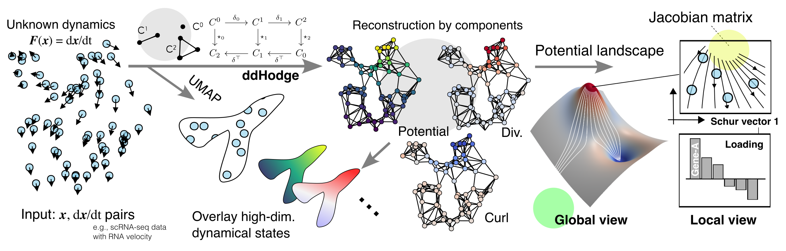

# ddHodge

[](https://kazumits.github.io/ddHodge.jl/stable/)
[](https://kazumits.github.io/ddHodge.jl/dev/)
[](https://github.com/kazumits/ddHodge.jl/actions/workflows/CI.yml?query=branch%3Amain)



A Julia package for reconstructing grad, div, and curl from sampled velocities.

## Install

The development version of ddHodge can be installed via:

```julia
using Pkg 
Pkg.add(url="https://github.com/kazumits/ddHodge.jl")
```

## Basic usage

Required inputs are the matrices of sampled data points `X` and the corresponding velocity `V`.
These matrices should be in the same size of *M* variables (rows) x *N* samples (columns).

The basic usage of ddHodge consists of the following two steps.

1. Graph construction (undirected `SimpleGraph` type of [Graphs.jl](https://github.com/JuliaGraphs/Graphs.jl))
2. Run ddHodge standard workflow with the options.

```julia
using ddHodge
g, kdtree, = kNNGraph(X,6) # k = 6
ddh = ddHodgeWorkflow(g,X,V,rdim=2) # rdim <= k
```

You can skip specifying `rdim` if no dimension reduction is required.

## GPU acceleration

After installing [CUDA.jl](https://github.com/JuliaGPU/CUDA.jl), you can try the GPU acceleration.

```julia
import CUDA
CUDA.@time ddh = ddHodgeWorkflow(g, X, V, rdim=4, useCUDA=true)
```

## RNA velocity data analysis 

Before you start, please:

* Install [Muon.jl](https://github.com/scverse/Muon.jl) to load [anndata](https://github.com/scverse/anndata) file after [scvelo](https://github.com/theislab/scvelo) analysis.
* Download the helper tool `H5ADHelper.jl` from [here](https://kazumits.github.io/ddh/tools/H5ADHelper.jl).

Below is a minimal example of RNA velocity data analysis.

```julia
# load scvelo output in anndata format
import Muon
h5file = "scvelo_out.h5ad"
adata = Muon.readh5ad(h5file,backed=false)
X = adata.obsm["X_pca"]' # should be transposed
V = adata.obsm["velocity_pca"]' # should be transposed

# ddHodge part
using ddHodge
g, kdtree, = kNNGraph(X,12) # k = 12
ddh = ddHodgeWorkflow(g,X,V,rdim=4) # rdim <= k

# save ddHodge results to the loaded anndata
@isdefined(H5Adh) || include("H5ADHelper.jl")
let featurestowrite = [:u,:div,:rot,:vgrass]
    [adata.obs[!,"ddh_$(ft)"] = getfield(ddh,ft) for ft in featurestowrite]
    H5Adh.insertddh(h5file,ddh,keys=featurestowrite)
end
```

Now, the cell-centered ddHodge results of potential: `ddh_u`, divergence: `ddh_div`, curl: `ddh_rot` and Grassmann distances (averaged at vertex-level): `ddh_vgrass` are accessible via `adata.obs.ddh_*`.

The saved results in `scvelo_out.h5ad` will be freely incorporated to your favorite platform: Python, R (via [anndata package](https://cran.r-project.org/web/packages/anndata/index.html)), and interactive single-cell data viewers (e.g., [UCSC Cell Browser](http://cellbrowser.rtfd.org/), [CELLxGENE](https://github.com/chanzuckerberg/cellxgene)).

## TODO

* Add tests and documents
* Add harmonic component analyzer

